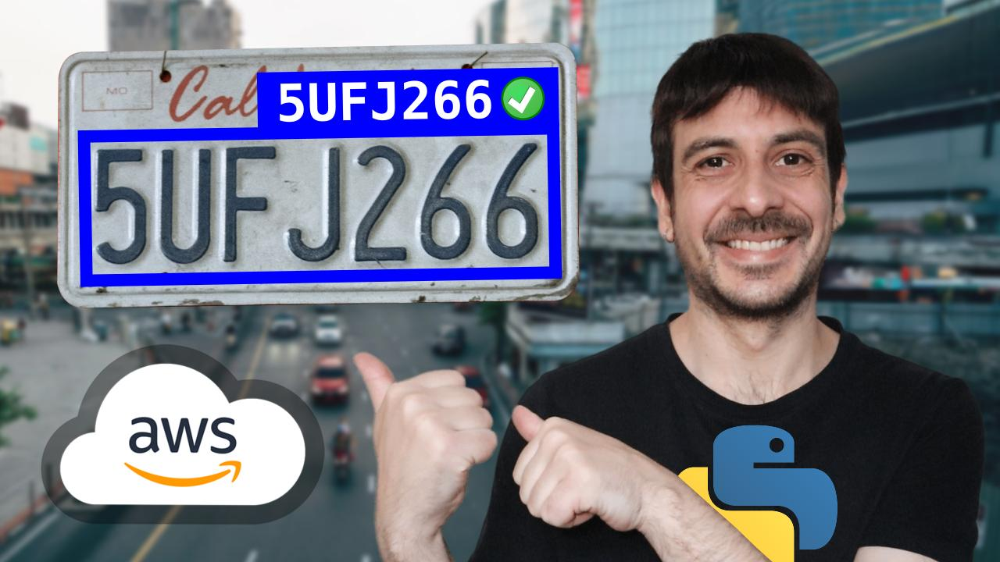

# real-time-number-plate-recognition-anpr

## pipeline

    

## execution

### setting up producer

- Go to [AWS](https://aws.amazon.com/) and login.
- Go to Kinesis Video Streams and create a video stream.
- Go to EC2 and launch a t2.small instance.
- SSH into the EC2 instance.
- Execute the following commands in the EC2 instance:

      sudo apt update

      git clone https://github.com/awslabs/amazon-kinesis-video-streams-producer-sdk-cpp.git

      mkdir -p amazon-kinesis-video-streams-producer-sdk-cpp/build

      cd amazon-kinesis-video-streams-producer-sdk-cpp/build

      sudo apt-get install libssl-dev libcurl4-openssl-dev liblog4cplus-dev libgstreamer1.0-dev libgstreamer-plugins-base1.0-dev gstreamer1.0-plugins-base-apps gstreamer1.0-plugins-bad gstreamer1.0-plugins-good gstreamer1.0-plugins-ugly gstreamer1.0-tools

      sudo apt  install cmake

      sudo apt-get install g++

      sudo apt-get install build-essential
  
      cmake .. -DBUILD_DEPENDENCIES=OFF -DBUILD_GSTREAMER_PLUGIN=ON

      make

      sudo make install

      cd ..

      export GST_PLUGIN_PATH=`pwd`/build

      export LD_LIBRARY_PATH=`pwd`/open-source/local/lib

- Download the video we will be using to test this project:

      cd ~

      wget https://raw.githubusercontent.com/computervisioneng/real-time-number-plate-recognition-anpr/main/sample_30fps_1440.mp4

- Go to IAM and create a new user with **AmazonKinesisVideoStreamsFullAccess** permissions.
- Select the IAM user you created, go to _Security credentials_ and create access keys.
- In the EC2 instance run the following command:

      gst-launch-1.0 -v  filesrc location="./sample_30fps_1440.mp4" ! qtdemux name=demux ! queue ! h264parse ! video/x-h264,stream-format=avc,alignment=au ! kvssink name=sink stream-name="stream-name" access-key="access-key" secret-key="secret-key" aws-region="region-name" streaming-type=offline demux. ! queue ! aacparse ! sink.

### setting up consumer #1: object detection and tracking

- Go to EC2 and launch a t2.xlarge instance with 30GB storage size.
- SSH into the EC2 instance.
- Execute the following commands in the EC2 instance:

      sudo apt update
  
      sudo apt install python3-virtualenv

      virtualenv venv --python=python3
  
      source venv/bin/activate
  
      git clone https://github.com/computervisioneng/amazon-kinesis-video-streams-consumer-library-for-python.git

      cd amazon-kinesis-video-streams-consumer-library-for-python
  
      git clone https://github.com/abewley/sort.git
  
      pip install -r requirements.txt
  
      pip install -r sort/requirements.txt
  
      pip install ultralytics

      sudo apt-get update && sudo apt-get install ffmpeg libsm6 libxext6  -y

      sudo apt-get install python3-tk

- Go to IAM and create an access role for the EC2 instance with the following policies: **AmazonKinesisVideoStreamsFullAccess**, **AmazonDynamoDBFullAccess**, **AmazonS3FullAccess** and **AmazonSQSFullAccess**.
- Attach the IAM role to the EC2 instance.
- Download the object detector into the EC2 instance.
- Go to S3 and create an S3 bucket.
- Go to Dynamodb and create two tables.
- Go to SQS and create a FIFO queue.
- Go to Lambda and create a new Lambda function with the files: **lambda_function.py** and **util.py**.
- Go to IAM and create an access role for the Lambda function with the following policies: **AmazonDynamoDBFullAccess**, **AmazonS3FullAccess**, **AmazonSQSFullAccess** and **TextractFullAccess**.
- Attach the IAM role to the Lambda function.
- Edit Lambda function timeout to 1 minute.
- Go to the S3 bucket and create a new event notification to trigger the lambda function.
- In the EC2 instance, go to **amazon-kinesis-video-streams-consumer-library-for-python/kvs_consumer_library_example_object_detection_and_tracking.py** and edit the variable names.
- In the Lambda function, go to **lambda_function.py** and edit the variable names.
- Execute the following commands:

      cd ~/amazon-kinesis-video-streams-consumer-library-for-python
      python kvs_consumer_library_example_object_detection_and_tracking.py

### setting up consumer #2: visualization

- Clone this repository https://github.com/computervisioneng/amazon-kinesis-video-streams-consumer-library-for-python.git
- Download the files **main_plot.py** and **process_queue.py**.
- Download the directory **loading_frames**.
- Go to IAM and create a new user with **AmazonKinesisVideoStreamsFullAccess**, **AmazonDynamoDBFullAccess** and **AmazonSQSFullAccess** permissions.
- Select the IAM user you created, go to _Security credentials_ and create access keys.
- Go to **main_plot.py**, **process_queue.py** and **amazon-kinesis-video-streams-consumer-library-for-python/kvs_consumer_library_example_visualization.py** and edit the variables.
- Create a virtual environment and install requirements.
- Execute **process_queue.py**.
- Execute **main_plot.py**.
- Execute **amazon-kinesis-video-streams-consumer-library-for-python/kvs_consumer_library_example_object_detection_and_tracking.py**.
